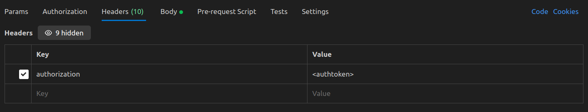
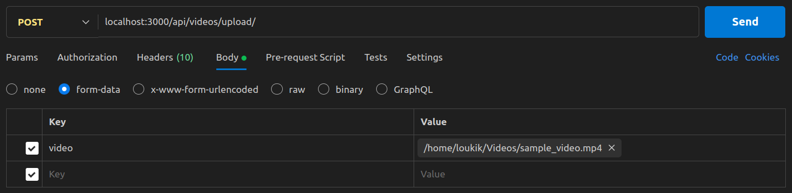
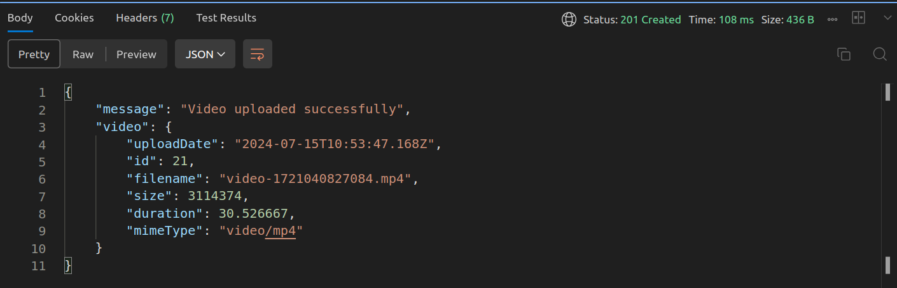
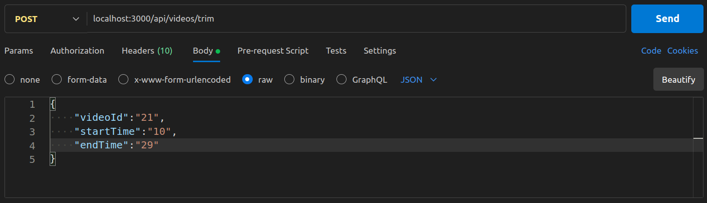
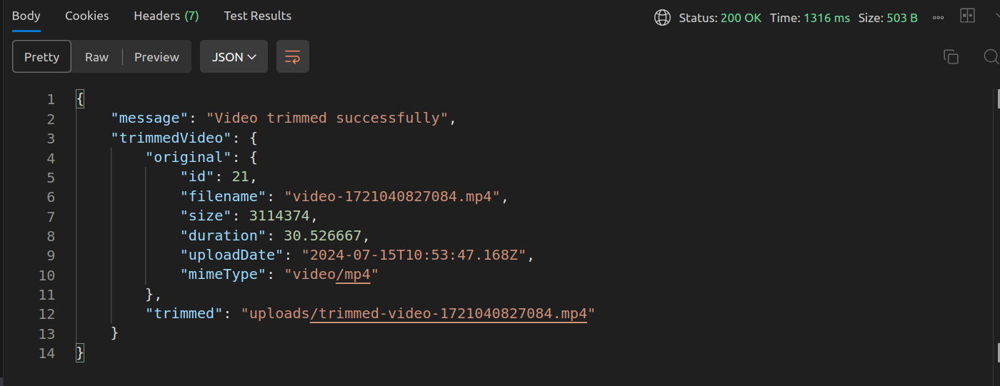

# Video Processing API

This project provides API endpoints for uploading and trimming videos.

## Endpoints

### Upload Video

**Endpoint:** `/upload`

**Method:** POST

**Description:** Upload a video file to the server.

**Request Body:**

`videoFile`: The video file to be uploaded.
eg:

1.keep the authtoken in the header

2. upload the video in the body -> form-data

3. click send and the file will be uploaded, the response will be like this:-

we can see the id of uploaded video is 21, we will need this id while trimming.

### Trim Video

**Endpoint:** `/trim`

**Method:** POST

**Description:** Trim a video based on specified start and end times.

**Request Body:**

* `videoId`: ID of the video to trim.
* `startTime`: Start time (in seconds) of the trim.
* `endTime`: End time (in seconds) of the trim.

**Example:**

1. same authorization step as upload
2. the body should look like this-

This will trim the video from 10 secs to 29 secs.

3.response will be like this -

a new video will be generated.

## Setup

1. Clone the repository:
   git clone https://github.com/TheHero29/VideoEditingBackend.git
   cd VideoEditingBackend
   
2. Install necessary dependencies:
   npm install

3. Start the server: 
  npm start
